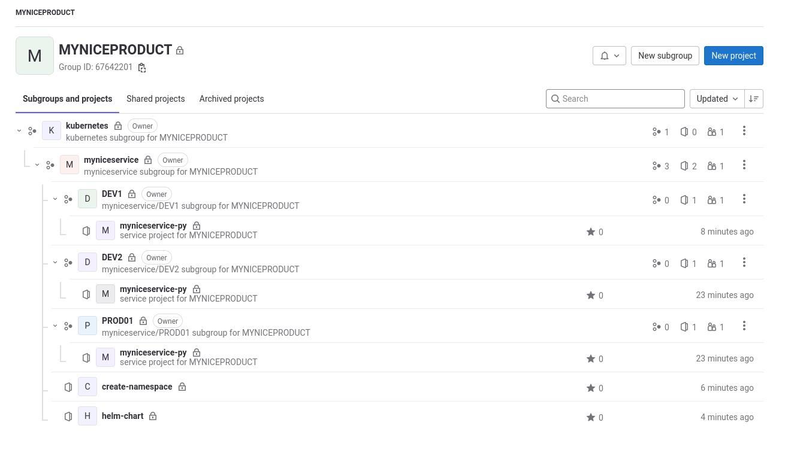

# Gitlab Template für Kubernetes Projekte

Beispiel demo-service

# Struktur in Gitlab
```
PRODUCT
└── kubernetes
    ├── demo-service
    │   ├── create-release-image
    │   │   ├── Dockerfile
    │   │   ├── pom.xml
    │   │   └── README.md
    │   ├── DEV1
    │   │   ├── deploy_client1
    │   │   │   ├── README.md
    │   │   │   └── values.yml
    │   │   └── deploy_client2
    │   │       ├── README.md
    │   │       └── values.yml
    │   ├── DEV2
    │   │   ├── deploy_client1
    │   │   │   ├── README.md
    │   │   │   └── values.yml
    │   │   └── deploy_client2
    │   │       ├── README.md
    │   │       └── values.yml
    │   ├── helm-chart
    │   │   └── chart
    │   │       ├── Chart.yaml
    │   │       ├── templates
    │   │       └── values.yaml
    │   └── PROD01
    │   │   ├── deploy_client1
    │   │   │   ├── README.md
    │   │   │   └── values.yml
    │   │   └── deploy_client2
    │   │       ├── README.md
    │   │       └── values.yml
    └── create-namespace
        ├── DEV1
        │   └── namespace.json
        ├── DEV2
        │   └── namespace.json
        └── PROD01
            └── namespace.json
```

Das Script legt die nötigen Gruppen und Repositories in Gitlab an. Es werden auch die Beispielpipelines aus dem demo-service Projekt eingefügt. Hier müssen dann die Werte entsprechend angepasst werden.

# Aufruf

```
cd scripts/
./gitlab_template.sh
Script muss mit zwei Parametern aufgerufen werden.
Bespiel: ./gitlab_template.sh PRODUCT demo-service
```

```
./gitlab_template.sh MYNICEPRODUCT myniceservice
```
# Ergebniss 
